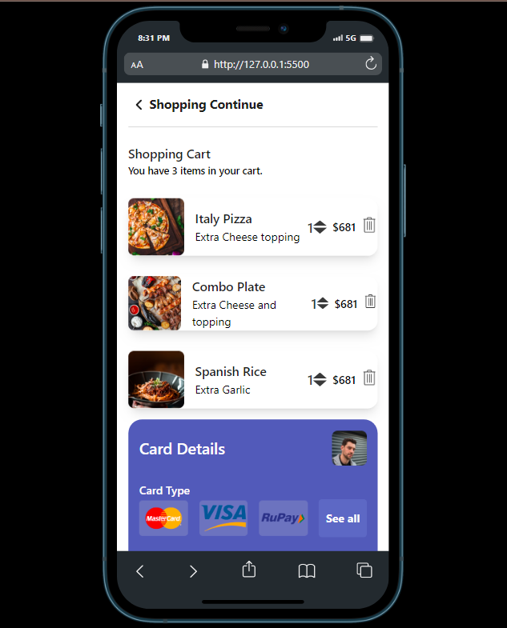
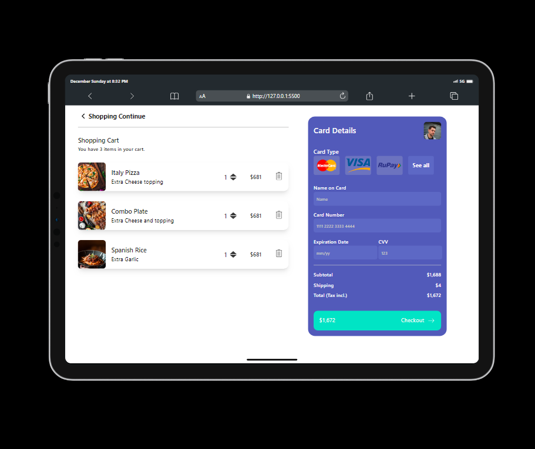

# Shopping-cart
## Project Overview
This is a simple project that will depict the functionality of a shopping cart. It helps the user to see items added to cart according to what the user has chosen.

## Tech Stack
This project is built with HTML for the markup and Tailwind for the styling of the project.

